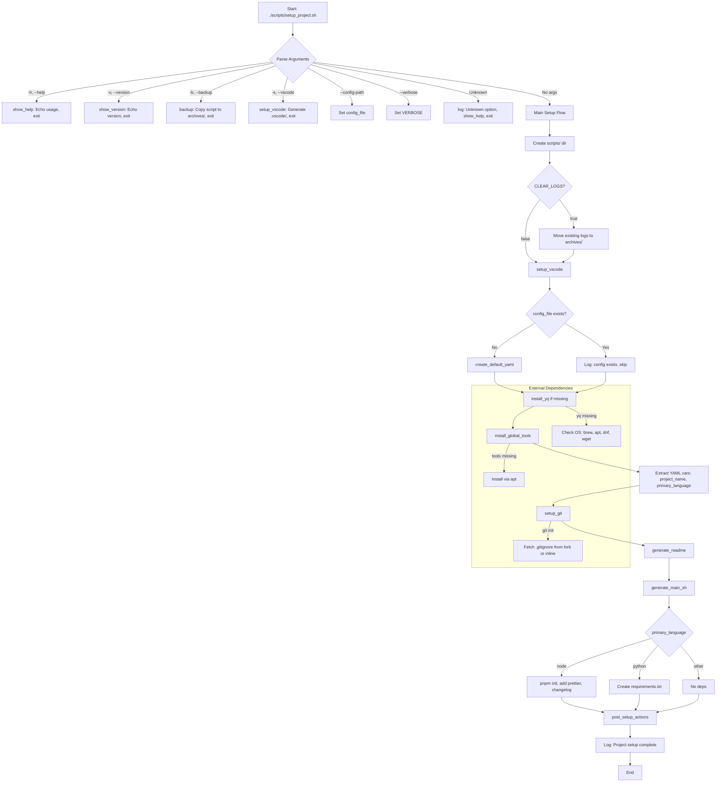

# Todo


## Rating

`setup_project.sh` script at version 0.2.4 is a robust foundation for automating project setup, and your recent changes (e.g., `CLEAR_LOGS`, skipping existing README/main.sh, VSCode checks for `code-insiders`) show thoughtful iteration. Below, I’ll provide a **rating/score** for the script’s design, features, and structure, a **Mermaid flowchart** to visualize its flow, a **project summary** for a GitHub README.md with badges and GitHub Actions, and address your goals for versioning, changelog, and modularity while maximizing YAML usage. I’ll also highlight remaining issues and suggest improvements for a stable v0.2.4 release before pushing to `https://github.com/DavitTec/setup_project`.

---

### 1. Rating/Score for Bash Script Design, Features, and Structure

**Overall Score: 8.5/10**

**Breakdown:**

- **Design (9/10)**:
  - **Strengths**: 
    - Modular structure with clear function separation (e.g., `parse_path`, `setup_git`, `setup_vscode`).
    - Consistent header format and TODOs for future work.
    - Use of `set -euo pipefail` for robust error handling.
    - Global variables (`project_name`, `VERSION`) are well-managed, avoiding scope issues.
    - YAML-driven configuration enhances flexibility and reproducibility.
  - **Weaknesses**:
    - Some functions (e.g., `log`, `backup`) are still embedded but planned for externalization (TODO #19, #20), which could reduce script size.
    - Limited error handling for external commands like `pnpm` or `curl` (partially addressed in TODO #4).
    - Hard-coded paths (e.g., `logs/`, `archives/`) could be parameterized via YAML.

- **Features (8/10)**:
  - **Strengths**:
    - Supports multiple languages (Node, Python, Bash, Perl, multi) via path inference.
    - Generates essential files (README, main.sh, .vscode configs, .gitignore).
    - Handles VSCode setup with sensible defaults and skips existing files.
    - Logging with verbosity levels (`off`, `on`, `debug`) and no-newline support.
    - Backup functionality with versioned archives.
    - YAML config for extensibility (though underutilized; see below).
  - **Weaknesses**:
    - Missing testing features (e.g., dry-run, unit tests; TODO #10).
    - No changelog generation (planned for versioning).
    - Limited YAML usage (e.g., only `project.*`, `git.*`, `dependencies.*` parsed; TODO #5, #6).
    - No GitHub Actions or CI/CD integration yet.
    - External script integration (logging, backup) is pending.

- **Structure (8.5/10)**:
  - **Strengths**:
    - Clear sectioning (HEADER, FUNCTIONS, MAIN, FOOTER, TODO).
    - Consistent logging with timestamp control.
    - ShellCheck-compliant in most areas (SC1091 explicitly disabled).
    - Well-documented with comments and TODOs.
  - **Weaknesses**:
    - Some TODOs (e.g., #19, #20) indicate planned refactoring that could simplify the script.
    - `install_global_tools` assumes `apt` without full OS detection (TODO #1).
    - Redundant log messages (e.g., `create_default_yaml` logs twice if file exists).

**Why 8.5/10?** The script is functional, well-organized, and aligns with your goal of automating project setup across languages with VSCode integration. It’s production-ready for simple use cases but lacks testing, full YAML utilization, and modularity (external scripts). Addressing TODOs #10, #19, #20, and adding GitHub Actions will push it toward 9.5/10.

---

### 2. Mermaid Flowchart

Below is a Mermaid flowchart representing the script’s execution flow, focusing on the `main()` function’s logic and key sub-functions. It captures the command-line argument parsing, major setup steps, and conditional paths.



**Notes**: 
- The flowchart omits low-level details (e.g., log function internals) for clarity.
- It highlights the modular flow and decision points (e.g., file existence checks, language-specific deps).
- To render, paste into a Mermaid-compatible viewer (e.g., GitHub Markdown preview, Mermaid Live Editor).

---

### 3. Project Summary for GitHub README.md

Below is a GitHub README.md template for your `setup_project` repository. It includes standard sections, badges, and a basic GitHub Actions workflow for linting/testing. The summary reflects the project’s purpose, features, and usage, tailored for `https://github.com/DavitTec/setup_project`.

```markdown
# Setup Project


`setup_project.sh` is a Bash script designed to automate the initialization of development projects, supporting multiple languages (Node.js, Python, Bash, Perl, etc.) with a focus on reproducibility, dependency management, and VSCode integration. It parses project details from the directory path or a YAML config (`initial_config.yaml`), sets up Git, generates essential files (README, main.sh, .vscode configs), and handles backups and logging.

## Features

- **Multi-Language Support**: Infers project language (Node.js, Python, Bash, Perl, multi) from path (e.g., `/opt/davit/development/node_recipe_website_v0.1/`).
- **YAML Configuration**: Uses `initial_config.yaml` for customizable project settings (name, version, dependencies, etc.).
- **VSCode Integration**: Generates `.vscode/settings.json` and `launch.json` for debugging.
- **Git Setup**: Initializes Git with templates from a custom fork (`DavitTec/gitignore`) or inline defaults.
- **Logging**: Configurable verbosity (`off`, `on`, `debug`) with timestamped logs to `logs/`.
- **Backup**: Archives script versions to `archives/`.
- **Extensibility**: Planned modularity for external logging and backup scripts.

## Installation

1. Clone the repository:
   ```bash
   git clone https://github.com/DavitTec/setup_project.git
   cd setup_project
```

2. Ensure dependencies (`git`, `yq`) are installed:
   ```bash
   sudo apt update && sudo apt install -y git yq
   ```

3. Run the script:
   ```bash
   ./scripts/setup_project.sh
   ```

## Usage

```bash
./scripts/setup_project.sh [options]
```

**Options**:
- `-h, --help`: Show help message
- `-v, --version`: Show script version
- `-b, --backup`: Backup script to `archives/`
- `-s, --vscode`: Setup VSCode configuration
- `--config-path <path>`: Specify custom `initial_config.yaml` path
- `--verbose <off|on|debug>`: Set logging verbosity (default: on)

**Example**:
```bash
# Full setup in /opt/davit/development/test_setup
./scripts/setup_project.sh
# Setup only VSCode
./scripts/setup_project.sh -s
# Run with debug logging
./scripts/setup_project.sh --verbose debug
```

## Configuration

The script uses `initial_config.yaml` for settings. Example:

```yaml
project:
  name: test_setup
  version: 0.1.0
  author: davit
  primary_language: bash
git:
  init: true
  template: bash
```

If missing, it’s generated based on the directory path.

## Contributing

Contributions are welcome! Please:
1. Fork the repo.
2. Create a feature branch (`git checkout -b feature/xyz`).
3. Commit with [Conventional Commits](https://www.conventionalcommits.org/).
4. Submit a pull request.

## Testing

(TODO: Add testing instructions once implemented.)

## Changelog

(TODO: Add CHANGELOG.md with versioning details.)

## License

MIT License. See [LICENSE](LICENSE) for details.

## Contact

David Mullins - [david@davit.ie](mailto:david@davit.ie) - [https://davit.ie](https://davit.ie)

Project Link: [https://github.com/DavitTec/setup_project](https://github.com/DavitTec/setup_project)
```

**Notes**:
- **Badges**: Added GitHub release, license, workflow status, and language/IDE badges. Update URLs when the repo is live.
- **GitHub Actions**: Below is a basic workflow for linting with ShellCheck and testing (placeholder for future tests).
- **Changelog**: Placeholder added; see below for setup.
- **Testing**: Placeholder added; see testing recommendations below.

---

### 4. GitHub Actions Workflow

To add CI/CD, create a file at `.github/workflows/lint-and-test.yml`:

```yaml
name: Lint and Test
on:
  push:
    branches: [main]
  pull_request:
    branches: [main]
jobs:
  lint:
    runs-on: ubuntu-latest
    steps:
      - uses: actions/checkout@v4
      - name: Install ShellCheck
        run: sudo apt update && sudo apt install -y shellcheck
      - name: Run ShellCheck
        run: shellcheck scripts/setup_project.sh
  test:
    runs-on: ubuntu-latest
    steps:
      - uses: actions/checkout@v4
      - name: Install dependencies
        run: sudo apt update && sudo apt install -y git yq
      - name: Run setup_project.sh
        run: ./scripts/setup_project.sh --verbose debug
      - name: Verify generated files
        run: |
          test -f README.md && echo "README.md exists"
          test -f main.sh && echo "main.sh exists"
          test -f .vscode/settings.json && echo "VSCode settings exist"
```

This workflow:
- Lints with ShellCheck on push/PR to `main`.
- Runs the script with debug verbosity and checks for generated files.
- Expand the `test` job once you add unit tests (see below).

---

### 5. Versioning and Changelog Features

To introduce versioning and changelog support:

- **Versioning**: You’re already using a `VERSION` global and parsing it with `awk`. Continue incrementing semantically (e.g., 0.3.0 for major features like external scripts). Consider a `--bump-version` flag to update the header programmatically.
- **Changelog**:
  - Use `conventional-changelog-cli` (already in YAML dependencies for Node projects).
  - Add a `generate_changelog` function to create/update `CHANGELOG.md` using Conventional Commits.
  - Example function:

```bash
generate_changelog() {
  if [[ "$primary_language" = "node" && -f "package.json" ]]; then
    npx conventional-changelog -p angular -i CHANGELOG.md -s -r 0 || log "Error: Changelog generation failed"
    log "Generated/Updated CHANGELOG.md"
  else
    cat <<EOF > CHANGELOG.md
# Changelog
## [$VERSION] - $(date +%Y-%m-%d)
- Initial release: Setup project with $primary_language support
EOF
    log "Generated basic CHANGELOG.md"
  fi
}
```

- Call it in `main()` after `generate_main_sh` or as a new `--changelog` option.
- Commit with messages like `feat: add changelog generation` to leverage `conventional-changelog`.

---

### 6. Maximizing YAML Usage

Your `initial_config.yaml` is underutilized. Currently, it drives `project.*`, `git.*`, and `dependencies.*`. To expand:

- **Env Section (TODO #6)**: Generate `.env` from `env`:
  ```bash
  generate_env() {
    local env_file=".env"
    if [[ -f "$env_file" ]]; then
      log "$env_file already exists; skipping"
      return
    fi
    yq e '.env | to_entries | .[] | "\(.key)=\(.value)"' "$config_file" > "$env_file" || log "Error: Failed to generate .env"
    log "Generated $env_file"
  }
  ```
  Call in `main()` after `generate_main_sh`.

- **Git Remote (TODO #5)**: Add `git.remote_url` to YAML and use in `setup_git`:
  ```yaml
  git:
    init: true
    template: bash
    remote_url: https://github.com/DavitTec/$(basename "$(pwd)")
  ```
  ```bash
  setup_git() {
    # ... existing code ...
    if [[ "$init" = "true" ]]; then
      git init || log "Error: git init failed"
      # ... .gitignore code ...
      local remote_url=""
      remote_url=$(yq e '.git.remote_url' "$config_file" || echo "")
      if [[ -n "$remote_url" ]]; then
        git remote add origin "$remote_url" || log "Error: Failed to set git remote"
        log "Set git remote to $remote_url"
      fi
    fi
  }
  ```

- **VSCode Extensions (TODO #7)**: Loop through `vscode.extensions` in `setup_vscode`:
  ```bash
  setup_vscode() {
    # ... existing checks ...
    local extensions=""
    extensions=$(yq e '.vscode.extensions[]' "$config_file" || log "Error: yq parse failed for extensions")
    for ext in $extensions; do
      code --install-extension "$ext" || log "Warning: Failed to install VSCode extension $ext"
    done
    # ... existing settings/launch code ...
  }
  ```

---

### 7. Testing Features

To add testing (TODO #10):
- **Dry-Run Mode**: Add a `--dry-run` flag that logs actions without executing file changes or commands.
  ```bash
  main() {
    local dry_run=false
    while [[ $# -gt 0 ]]; do
      case $1 in
        --dry-run) dry_run=true ;;
        # ... other cases ...
      esac
      shift
    done
    if "$dry_run"; then
      log "Dry-run mode: Simulating actions"
      # Mock functions or skip writes
    fi
    # ... rest of main ...
  }
  ```
- **Unit Tests**: Create a `tests/` directory with a test script using `bats` (Bash Automated Testing System). Install via `sudo apt install bats`.
  ```bash
  # tests/setup_project.bats
  @test "setup_project.sh creates README.md" {
    run ./scripts/setup_project.sh
    [ -f "README.md" ]
  }
  @test "setup_project.sh -b creates backup" {
    run ./scripts/setup_project.sh -b
    [ -f "archives/setup_project_v$VERSION.sh" ]
  }
  ```
  Run with `bats tests/setup_project.bats`.

---

### 8. Modularity and External Scripts

To reduce functions (e.g., `log`, `backup`, `setup_git`):
- **External Logging (TODO #19)**:
  ```bash
  if [[ -f "./scripts/logging.sh" ]]; then
    # shellcheck source=./scripts/logging.sh
    source "./scripts/logging.sh"
  else
    log() { ... } # Keep inline as fallback
  fi
  ```
  Example `logging.sh`:
  ```bash
  # scripts/logging.sh
  LAST_LOG_NO_NEWLINE=false
  log() { ... } # Move current log function
  ```
- **External Backup (TODO #20)**:
  ```bash
  if [[ -f "./scripts/backup.sh" ]]; then
    # shellcheck source=./scripts/backup.sh
    source "./scripts/backup.sh"
  else
    backup() { ... } # Keep inline
  fi
  ```
  Example `backup.sh`:
  ```bash
  # scripts/backup.sh
  backup() {
    mkdir -p archives
    cp "./scripts/setup_project.sh" "archives/setup_project_v$VERSION.sh"
    tar -czf "archives/backup_$(date +%Y%m%d).tar.gz" logs/ .vscode/ || log "Error: Backup tar failed"
    log "Backed up setup_project.sh and logs"
  }
  ```
- **Git Actions (TODO #18)**:
  ```bash
  if [[ -f "./scripts/git_setup.sh" ]]; then
    # shellcheck source=./scripts/git_setup.sh
    source "./scripts/git_setup.sh"
  else
    setup_git() { ... } # Keep inline
  fi
  ```

---

### 9. Issues in v0.2.4

- **Git Template**: `initial_config.yaml` hardcodes `template: Node` (capitalized), but `setup_git` expects lowercase (e.g., `node`). Normalize to lowercase or validate.
- **Log Reset**: `find "./logs" -name "setup_project_*.log"` may match multiple files; use `mv` carefully or specify one. Check for `archives/` existence.
- **Dependencies**: `pnpm` commands run without checking if `pnpm` is installed.
- **ShellCheck**: Run `shellcheck setup_project.sh`. Potential warnings:
  - SC2086: Quote `$echo_opts` in `echo $echo_opts -n "$log_entry"`.
  - SC2155: Combine `local timestamp=$(date ...)` for efficiency.
  - SC2126: Quote `$tools` in `for tool in $tools` if spaces possible.

---

### 10. Updated Script (v0.2.4)

Here’s the tidied script with minor fixes (lowercase `node` in YAML, safer log reset, quoted expansions, check for `pnpm`). It’s ready for GitHub but keeps inline functions until external scripts are ready.

```bash
#!/bin/bash
# Script: setup_project.sh
# Version: 0.2.4
# Description: Automates initial project setup, including config creation, dependency installation, git init, and file generation based on path inference or YAML config.
# Purpose: Bootstrap small to monorepo projects across languages (Node, Python, Bash, Perl, etc.) with reproducibility, dependency management, and VSCode integration.
# Alias: setprj
# Created: 2025-07-12
# Updated: 2025-07-14
# Author: David Mullins
# Contact: david@davit.ie / https://davit.ie
# Git: https://github.com/DavitTec/$(basename "$(pwd)")
# Usage: ./scripts/setup_project.sh [options]
#   Options:
#     -h, --help: Show this help message
#     -v, --version: Show script version
#     -b, --backup: Backup script to archives
#     -s, --vscode: Setup vscode
#     --config-path <path>: Specify custom path to initial_config.yaml
#     --verbose <off|on|debug>: Set logging verbosity (default: on)
# License: MIT
# Status: development
####### /HEADER #######

set -euo pipefail # Stricter error handling: exit on errors, unset vars, failed pipes

####### FUNCTIONS #######

# Global variables
declare -g VERBOSE="on"              # Default verbosity: off (no terminal logs), on (info to terminal), debug (all to terminal)
declare -g LAST_LOG_NO_NEWLINE=false # Track if last log ended without newline for continuations
declare -g VERSION
VERSION=$(awk '/^####### \/HEADER #######/ {exit} /^# Version:/ {print $3}' "$0")
declare -g CLEAR_LOGS=true # Delete logs at start, default true

# Logging Function
# TODO: #019 Source logging script if available
log() {
  local opt=""
  local msg_level="info"
  local echo_opts=""
  local no_newline=false
  OPTIND=1
  while getopts ":den" opt; do
    case "$opt" in
    d) msg_level="debug" ;;
    e) echo_opts="-e" ;;
    n) no_newline=true ;;
    *) log "Invalid option: -$OPTARG" ;; # Recursive, but careful
    esac
  done
  shift $((OPTIND - 1))

  local message="$1"
  [[ -z "$message" ]] && return

  local LOG_DIR="logs"
  local timestamp
  local script_name
  local log_file
  local log_entry
  timestamp=$(date '+%Y-%m-%d %H:%M:%S')
  script_name=$(basename "${BASH_SOURCE[1]}" .sh)
  log_file="${LOG_DIR}/${script_name}_$(date '+%Y%m%d').log"

  if "$LAST_LOG_NO_NEWLINE"; then
    log_entry="$message" # Continuation: no timestamp
  else
    log_entry="[$timestamp] $message"
  fi

  # Always log to file
  mkdir -p "$LOG_DIR"
  if "$no_newline"; then
    echo "$echo_opts" -n "$log_entry" >>"$log_file"
  else
    echo "$echo_opts" "$log_entry" >>"$log_file"
  fi

  # Log to terminal (stderr) based on verbosity
  if [[ "$msg_level" = "info" && "$VERBOSE" != "off" ]]; then
    if "$no_newline"; then
      echo "$echo_opts" -n "$log_entry" >&2
    else
      echo "$echo_opts" "$log_entry" >&2
    fi
  elif [[ "$msg_level" = "debug" && "$VERBOSE" = "debug" ]]; then
    if "$no_newline"; then
      echo "$echo_opts" -n "$log_entry" >&2
    else
      echo "$echo_opts" "$log_entry" >&2
    fi
  fi

  # Update flag for next call
  if "$no_newline"; then
    LAST_LOG_NO_NEWLINE=true
  else
    LAST_LOG_NO_NEWLINE=false
  fi
}

# Function to backup this script to archives
# TODO: #020 Integrate external backup script
backup() {
  mkdir -p archives
  local source="./scripts/setup_project.sh"
  local backup_file="archives/setup_project_v$VERSION.sh"
  cp "$source" "$backup_file"
  # TODO: #023 what else to backup
  #       1) probably to gzip all to a external folder
  local timestamp
  timestamp=$(date '+%Y-%m-%d %H:%M:%S')
  echo "[$timestamp] Backed up setup_project.sh"
}

# Function to setup vscode
# TODO: #016 check code and or vscode-insiders
setup_vscode() {
  local vscode_dir="./.vscode/"
  if ! command -v code &>/dev/null && ! command -v code-insiders &>/dev/null; then
    log "Warning: VSCode (code or code-insiders command) not found; skipping setup"
    return
  fi
  if [[ -f "$vscode_dir/settings.json" && -f "$vscode_dir/launch.json" ]]; then
    log "VSCode setup already exists; skipping"
    return
  fi
  log "Setting up vscode for development"
  mkdir -p "$vscode_dir"
  local vscode_settings="$vscode_dir/settings.json"
  local vscode_launch="$vscode_dir/launch.json"
  log "Setting up VS Code settings..."
  cat <<EOF >"$vscode_settings"
{
  "editor.formatOnSave": true,
  "editor.codeActionsOnSave": {
    "source.fixAll": true,
    "source.organizeImports": true
  },
  "files.autoSave": "afterDelay",
  "files.autoSaveDelay": 1000,
  "eslint.format.enable": true,
  "eslint.validate": ["typescript", "typescriptreact"],
  "prettier.enable": true,
  "[typescript]": {
    "editor.defaultFormatter": "esbenp.prettier-vscode"
  },
  "editor.fontSize": 12,
  "editor.defaultFormatter": "esbenp.prettier-vscode",
  "files.exclude": {
    "archives/*": false
  },
  "editor.tabSize": 2,
  "editor.autoIndent": "advanced",
  "notebook.defaultFormatter": "esbenp.prettier-vscode"
}
EOF
  log "Generated $vscode_settings"

  cat <<EOF >"$vscode_launch"
{
  "version": "0.2.0",
  "configurations": [
    {
      "type": "bashdb",
      "request": "launch",
      "name": "Bash-Debug (simplest configuration)",
      "program": "\${workspaceFolder}/scripts/setup_project.sh",
      "showDebugOutput": true
    }
  ]
}
EOF
  log "Generated $vscode_launch"
}

# Function to display help/usage
show_help() {
  echo "Usage: $0 [options]"
  echo "Options:"
  echo "  -h, --help: Show this help message"
  echo "  -v, --version: Show script version"
  echo "  -b, --backup: Backup script to archives"
  echo "  -s, --vscode: Setup vscode"
  echo "  --config-path <path>: Specify custom path to initial_config.yaml"
  echo "  --verbose <off|on|debug>: Set logging verbosity (default: on)"
  exit 0
}

# Function to display version
show_version() {
  echo "setup_project.sh version $VERSION"
  exit 0
}

# Function to parse project details from path
parse_path() {
  local full_path=""
  local root_name=""
  local subfolders=()
  full_path="$(pwd)"
  root_name="$(basename "$full_path")"
  IFS='/' read -ra subfolders <<<"$full_path"

  project_name="${root_name%%_v[0-9.]*}" # Global
  version=$(echo "$root_name" | sed -n 's/.*_v\([0-9.]*\).*/\1.0/p') # Global
  [[ -z "$version" ]] && version="$VERSION"

  primary_language="bash" # Global, Default
  frameworks=()          # Global
  if [[ "$full_path" =~ /node/ || "$project_name" =~ ^node_ ]]; then
    primary_language="node"
    if [[ "$full_path" =~ /next/ ]]; then
      frameworks+=("next.js")
    fi
  elif [[ "$full_path" =~ /python/ ]]; then
    primary_language="python"
  elif [[ "$full_path" =~ /perl/ ]]; then
    primary_language="perl"
  elif [[ "$full_path" =~ /bashscripts/ ]]; then
    primary_language="bash"
  elif [[ "$full_path" =~ /monorepo/ ]]; then
    primary_language="multi"
  fi

  author="${subfolders[2]:-$(whoami)}" # Global, e.g., davit from /opt/davit/...

  environment="development"                          # Global
  private="true"                                     # Global
  description="Auto-generated project based on path" # Global

  log -d "Inferred: Name=$project_name, Version=$version, Language=$primary_language, Frameworks=${frameworks[*]}, Author=$author"
}

# Function to create basic initial_config.yaml if missing
create_default_yaml() {
  local config_file="$1"
  parse_path

  local frameworks_joined=""
  frameworks_joined=$(IFS=', '; echo "${frameworks[*]}")

  cat <<EOF >"$config_file"
# initial_config.yaml
config_version: 1.0

project:
  name: $project_name
  version: $version
  author: $author
  description: "$description"
  private: $private
  environment: $environment
  primary_language: $primary_language
  frameworks: [$frameworks_joined]

dependencies:
  global_tools:
    - name: git
      min_version: 2.30
      install_if_missing: true
    - name: yq
      min_version: 4.0
      install_if_missing: true
  project_specific:
    - prettier: ^3.0
    - conventional-changelog-cli: ^2.0

git:
  init: true
  template: $primary_language

env:
  NODE_ENV: development

vscode:
  extensions: [esbenp.prettier-vscode]

post_setup:
  archive_config: true
EOF
  log "Created default $config_file"
}

# Function to install missing global tools (e.g., git, yq)
install_global_tools() {
  local tools
  tools=$(yq e '.dependencies.global_tools[] | .name' "$config_file" || log "Error: yq parse failed for tools")
  for tool in $tools; do
    if ! command -v "$tool" &>/dev/null; then
      local install
      install=$(yq e ".dependencies.global_tools[] | select(.name == \"$tool\") | .install_if_missing" "$config_file" || log "Error: yq parse failed for install flag")
      if [[ "$install" = "true" ]]; then
        log -n "Installing $tool... "
        if sudo apt update && sudo apt install -y "$tool"; then
          log "done"
        else
          log "Error: Installation of $tool failed"
        fi
      fi
    fi
  done
}

# Function to setup git
setup_git() {
  log "GIT: setting up git"
  local init
  init=$(yq e '.git.init' "$config_file" || log "Error: yq parse failed for git.init")
  if [[ "$init" = "true" ]]; then
    git init || log "Error: git init failed"
    local template
    template=$(yq e '.git.template' "$config_file" || log "Error: yq parse failed for git.template")
    URL="https://raw.githubusercontent.com/DavitTec/gitignore/main/${template}.gitignore"
    if curl -s "$URL" > .gitignore; then
      echo -e "\n# Archives\narchives/" >> .gitignore
      log "Git initialized with $template template from fork"
    else
      log "Error: Failed to fetch .gitignore template from fork; falling back to inline"
      if [[ "$template" = "bash" ]]; then
        cat <<EOF > .gitignore
# Temp files
*~
*.swp
*.tmp
*.bak

# Logs and archives
logs/
archives/

# OS/Editor files
.DS_Store
Thumbs.db
.vscode/

# Bash specific
*.sh~
EOF
        log "Used inline bash template"
      fi
    fi
  fi
}

# Function to generate README.md (simulate Create_Readme.sh)
generate_readme() {
  local readme="README.md"
  parse_path
  if [[ -f "$readme" ]]; then
    log "$readme already exists; skipping"
    return
  fi

  cat <<EOF >"$readme"
# $project_name

## Description
$description

## Version
$version

## Author
$author

## Setup
Run ./main.sh -s

## Usage
- Initialize: ./main.sh -init
- Install: ./main.sh -i
EOF
  log "Generated $readme"
}

# Function to generate main.sh with standard functions
generate_main_sh() {
  local main_sh="main.sh"
  if [[ -f "$main_sh" ]]; then
    log "$main_sh already exists; skipping"
    return
  fi

  cat <<'EOF' >"$main_sh"
#!/bin/bash
# Script: main.sh
# Version: 0.1.0
# Description: Main control script for project management
# Author: David Mullins
# License: MIT

usage() {
    echo "Usage: $0 [option]"
    echo "Options: -init, -s (setup), -i (install), -u (update), -b (backup), -d (uninstall), -v (version), -h (help)"
}

backup() {
    local version
    version=$(awk '/^####### \/HEADER #######/ {exit} /^# Version:/ {print $3}' ./scripts/setup_project.sh)
    mkdir -p archives
    cp ./scripts/setup_project.sh "archives/setup_project_v$version.sh"
    # TODO: what else to backup
    local timestamp
    timestamp=$(date '+%Y-%m-%d %H:%M:%S')
    echo "[$timestamp] Backed up setup_project.sh"
}

main() {
    case "$1" in
        -init|--initialize) echo "Initializing..." ;;
        -s|--setup) echo "Setting up..." ;;
        -i|--install) echo "Installing..." ;;
        -u|--update) echo "Updating..." ;;
        -b|--backup) backup ;;
        -d|--uninstall) echo "Uninstalling..." ;;
        -v|--version) echo "Version $(awk '/^####### \/HEADER #######/ {exit} /^# Version:/ {print $3}' "$0")" ;;
        -h|--help) usage ;;
        *) usage ;;
    esac
}

main "$@"
EOF
  chmod +x "$main_sh"
  log "Generated $main_sh"
}

# Function to archive config and script
post_setup_actions() {
  local archive
  archive=$(yq e '.post_setup.archive_config' "$config_file" || log "Error: yq parse failed for post_setup")
  if [[ "$archive" = "true" ]]; then
    mkdir -p archives
    mv "$config_file" "archives/initial_config_$(date +%Y%m%d).yaml" || log "Error: Failed to archive config"
  fi
  if [[ -f "main.sh" ]]; then
    ./main.sh -b
  fi
}

# Function to install yq
install_yq() {
  log -n "Installing yq... "
  local arch
  arch=$(uname -m)
  local yq_binary="yq_linux_amd64"
  if [[ "$arch" == "aarch64" || "$arch" == "arm64" ]]; then
    yq_binary="yq_linux_arm64"
  fi
  if [[ "$OSTYPE" == "darwin"* ]]; then
    if command -v brew &>/dev/null; then
      brew install yq && log "done (via brew)"
    else
      log "Error: brew not found on macOS"
      return 1
    fi
  elif [[ "$OSTYPE" == "linux-gnu"* ]]; then
    if [[ -f /etc/os-release ]]; then
      # shellcheck source=/etc/os-release
      # shellcheck disable=SC1091
      source /etc/os-release
      if [[ "$ID" == "ubuntu" || "$ID_LIKE" == "debian" ]]; then
        sudo apt update && sudo apt install -y yq && log "done (via apt)"
      elif [[ "$ID" == "fedora" ]]; then
        sudo dnf install -y yq && log "done (via dnf)"
      else
        local confirm=""
        read -p "Unknown distro; install via wget? (y/n): " -r confirm
        if [[ "$confirm" == "y" ]]; then
          if sudo wget https://github.com/mikefarah/yq/releases/download/v4.44.3/$yq_binary -O /usr/local/bin/yq && sudo chmod +x /usr/local/bin/yq; then
            log "done (via wget)"
          else
            log "Error: wget failed"
            return 1
          fi
        else
          log "Skipped yq install"
          return 1
        fi
      fi
    else
      log "Error: Unable to detect Linux distro"
      return 1
    fi
  else
    log "Error: Unsupported OS: $OSTYPE"
    return 1
  fi
}

# Main function
main() {
  local config_file="initial_config.yaml"

  while [[ $# -gt 0 ]]; do
    case $1 in
    -h | --help) show_help ;;
    -b | --backup)
      backup
      exit 0
      ;;
    -s | --vscode)
      setup_vscode
      exit 0
      ;;
    -v | --version) show_version ;;
    --config-path)
      config_file="$2"
      shift
      ;;
    --verbose)
      VERBOSE="$2"
      shift
      ;;
    *)
      log "Unknown option: $1"
      show_help
      ;;
    esac
    shift
  done

  log "scripts_dir: $PWD/scripts"
  mkdir -p scripts

  if "$CLEAR_LOGS"; then
    local logfile
    logfile=$(find ./logs -name "setup_project_*.log" -print -quit 2>/dev/null)
    if [[ -n "$logfile" ]]; then
      mkdir -p archives
      mv "$logfile" "./archives/" || log "Error: Failed to move $logfile"
      log "[Reset] $logfile moved to ./archives"
      log "[NEW] ########### Logfile created ##############"
    fi
  fi

  setup_vscode

  if [[ ! -f "$config_file" ]]; then
    create_default_yaml "$config_file"
    log "$config_file file does not exist, creating"
  else
    log "$config_file file already exists, skipping"
  fi

  if ! command -v yq &>/dev/null; then
    if install_yq; then
      yq --version
    else
      log "Error: yq installation failed or skipped; script may fail"
    fi
  fi

  install_global_tools

  project_name=$(yq e '.project.name' "$config_file")
  primary_language=$(yq e '.project.primary_language' "$config_file")

  setup_git
  generate_readme
  generate_main_sh

  if [[ "$primary_language" = "node" ]]; then
    if command -v pnpm &>/dev/null; then
      pnpm init -y
      pnpm add -D prettier conventional-changelog-cli
    else
      log "Error: pnpm not found; skipping Node.js dependencies"
    fi
  elif [[ "$primary_language" = "python" ]]; then
    echo "prettier==3.0" >requirements.txt
  fi

  post_setup_actions

  log "Project setup complete!"
}

####### MAIN #######
main "$@"

######## FOOTER #######

# End of script

######## TODO #######
# TODO: #001 [OS] Add OS detection for install commands (e.g., brew for mac)  # Partially done for yq
# TODO: #002 [OS] Handle multi-language more robustly (e.g., generate multiple dep files)
# TODO: #003 [README] Integrate actual Create_Readme.sh if exists
# TODO: #004 [ERROR] Add error handling for commands  # Expanded
# TODO: #005 [YAML] Support custom git remote from YAML
# TODO: #006 [Config] Generate .env from YAML env section
# TODO: #007 [Vscode] VSCode settings generation
# TODO: #008 [TEST] Test on monorepo paths
# TODO: #009 [Logging] Enhance log function with more levels or colors if needed
# TODO: #010 [TEST] Add --dry-run mode to simulate actions
# TODO: #011 [UI] Prompt/flag for tool installations (e.g., --no-install)
# TODO: #012 [SHELLCHECK] Run shellcheck automatically or add directives
# TODO: #013 [Backup] Make backup() in main.sh use setup_project.sh's version  # Fixed
# TODO: #014 [WIN] Add support for Windows (e.g., via WSL detection)
# TODO: #015 [YAML] Detect architecture for yq binary downloads  # Done
# TODO: #016 [Vscode] Add check for VSCode installation  # Done
# TODO: #017 [Gitignore] Add a "bash" gitignore template to https://github/DavitTec/gitignore/
# TODO: #018 [Gitignore] Add a function for modifying ".gitignore"
# TODO: #019 [Logging] Integrate external logging script
# TODO: #020 [Backup] Integrate external backup script
# TODO: #021 [Manpages] Fix manpage: https://davit.ie/docs/$(basename "$(pwd)")
# TODO: #022 [Logging] Build and source logging script if available
# TODO: #023 [BACKUP] What else to backup (e.g., gzip to external folder)
# TODO: #024 [Changelog] Add changelog generation with conventional-changelog
# TODO: #025 [Testing] Add unit tests with bats
```

---

### Next Steps

1. **Push to GitHub**:
   - Create `https://github.com/DavitTec/setup_project`.
   - Add `README.md`, `.github/workflows/lint-and-test.yml`, and a `LICENSE` file (MIT).
   - Commit with `feat: initial release of setup_project.sh v0.2.4`.
   - Tag: `git tag v0.2.4 && git push origin v0.2.4`.

2. **External Scripts**:
   - Create `scripts/logging.sh` and `scripts/backup.sh` with the suggested structures.
   - Update `main()` to source them if present.

3. **Testing**:
   - Install `bats` and add tests as shown.
   - Test on different paths (e.g., monorepo, Node, Python; TODO #8).

4. **Changelog**:
   - Add `generate_changelog` and call it in `main()` or via a new `--changelog` flag.
   - Use Conventional Commits for future changes.

5. **YAML Expansion**:
   - Implement `generate_env` and git remote setup as shown.
   - Add more YAML fields (e.g., `vscode.settings` for custom JSON).

6. **Gitignore Fork**:
   - Add a `bash.gitignore` to `https://github.com/DavitTec/gitignore` and update `URL` in `setup_git`.

This version is stable for GitHub release. Focus on TODOs #10, #19, #20, #24, #25 for v0.3.0 to enhance testing and modularity.
