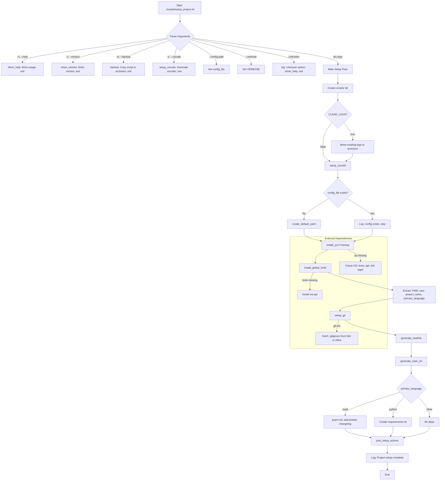

# Todo


---

### 1. Mermaid Flowchart

Below is a Mermaid flowchart representing the script’s execution flow, focusing on the `main()` function’s logic and key sub-functions. It captures the command-line argument parsing, major setup steps, and conditional paths.



**Notes**:

- The flowchart omits low-level details (e.g., log function internals) for clarity.
- It highlights the modular flow and decision points (e.g., file existence checks, language-specific deps).
- To render, paste into a Mermaid-compatible viewer (e.g., GitHub Markdown preview, Mermaid Live Editor).

---

### 2. GitHub Actions Workflow

To add CI/CD, create a file at `.github/workflows/lint-and-test.yml`:

```yaml
name: Lint and Test
on:
  push:
    branches: [main]
  pull_request:
    branches: [main]
jobs:
  lint:
    runs-on: ubuntu-latest
    steps:
      - uses: actions/checkout@v4
      - name: Install ShellCheck
        run: sudo apt update && sudo apt install -y shellcheck
      - name: Run ShellCheck
        run: shellcheck scripts/setup_project.sh
  test:
    runs-on: ubuntu-latest
    steps:
      - uses: actions/checkout@v4
      - name: Install dependencies
        run: sudo apt update && sudo apt install -y git yq
      - name: Run setup_project.sh
        run: ./scripts/setup_project.sh --verbose debug
      - name: Verify generated files
        run: |
          test -f README.md && echo "README.md exists"
          test -f main.sh && echo "main.sh exists"
          test -f .vscode/settings.json && echo "VSCode settings exist"
```

This workflow:

- Lints with ShellCheck on push/PR to `main`.
- Runs the script with debug verbosity and checks for generated files.
- Expand the `test` job once you add unit tests (see below).

---

### 3. Versioning and Changelog Features

To introduce versioning and changelog support:

- **Versioning**: You’re already using a `VERSION` global and parsing it with `awk`. Continue incrementing semantically (e.g., 0.3.0 for major features like external scripts). Consider a `--bump-version` flag to update the header programmatically.
- **Changelog**:
  - Use `conventional-changelog-cli` (already in YAML dependencies for Node projects).
  - Add a `generate_changelog` function to create/update `CHANGELOG.md` using Conventional Commits.
  - Example function:

```bash
generate_changelog() {
  if [[ "$primary_language" = "node" && -f "package.json" ]]; then
    npx conventional-changelog -p angular -i CHANGELOG.md -s -r 0 || log "Error: Changelog generation failed"
    log "Generated/Updated CHANGELOG.md"
  else
    cat <<EOF > CHANGELOG.md
# Changelog
## [$VERSION] - $(date +%Y-%m-%d)
- Initial release: Setup project with $primary_language support
EOF
    log "Generated basic CHANGELOG.md"
  fi
}
```

- Call it in `main()` after `generate_main_sh` or as a new `--changelog` option.
- Commit with messages like `feat: add changelog generation` to leverage `conventional-changelog`.

---

### 4. Maximizing YAML Usage

Your `initial_config.yaml` is underutilized. Currently, it drives `project.*`, `git.*`, and `dependencies.*`. To expand:

- **Env Section (TODO #6)**: Generate `.env` from `env`:

  ```bash
  generate_env() {
    local env_file=".env"
    if [[ -f "$env_file" ]]; then
      log "$env_file already exists; skipping"
      return
    fi
    yq e '.env | to_entries | .[] | "\(.key)=\(.value)"' "$config_file" > "$env_file" || log "Error: Failed to generate .env"
    log "Generated $env_file"
  }
  ```

  Call in `main()` after `generate_main_sh`.

- **Git Remote (TODO #5)**: Add `git.remote_url` to YAML and use in `setup_git`:

  ```yaml
  git:
    init: true
    template: bash
    remote_url: https://github.com/DavitTec/$(basename "$(pwd)")
  ```

  ```bash
  setup_git() {
    # ... existing code ...
    if [[ "$init" = "true" ]]; then
      git init || log "Error: git init failed"
      # ... .gitignore code ...
      local remote_url=""
      remote_url=$(yq e '.git.remote_url' "$config_file" || echo "")
      if [[ -n "$remote_url" ]]; then
        git remote add origin "$remote_url" || log "Error: Failed to set git remote"
        log "Set git remote to $remote_url"
      fi
    fi
  }
  ```

- **VSCode Extensions (TODO #7)**: Loop through `vscode.extensions` in `setup_vscode`:

  ```bash
  setup_vscode() {
    # ... existing checks ...
    local extensions=""
    extensions=$(yq e '.vscode.extensions[]' "$config_file" || log "Error: yq parse failed for extensions")
    for ext in $extensions; do
      code --install-extension "$ext" || log "Warning: Failed to install VSCode extension $ext"
    done
    # ... existing settings/launch code ...
  }
  ```

---

### 5. Testing Features

To add testing (TODO #10):

- **Dry-Run Mode**: Add a `--dry-run` flag that logs actions without executing file changes or commands.

  ```bash
  main() {
    local dry_run=false
    while [[ $# -gt 0 ]]; do
      case $1 in
        --dry-run) dry_run=true ;;
        # ... other cases ...
      esac
      shift
    done
    if "$dry_run"; then
      log "Dry-run mode: Simulating actions"
      # Mock functions or skip writes
    fi
    # ... rest of main ...
  }
  ```

- **Unit Tests**: Create a `tests/` directory with a test script using `bats` (Bash Automated Testing System). Install via `sudo apt install bats`.

  ```bash
  # tests/setup_project.bats
  @test "setup_project.sh creates README.md" {
    run ./scripts/setup_project.sh
    [ -f "README.md" ]
  }
  @test "setup_project.sh -b creates backup" {
    run ./scripts/setup_project.sh -b
    [ -f "archives/setup_project_v$VERSION.sh" ]
  }
  ```

  Run with `bats tests/setup_project.bats`.

---

### 6. Modularity and External Scripts

To reduce functions (e.g., `log`, `backup`, `setup_git`):

- **External Logging (TODO #19)**:

  ```bash
  if [[ -f "./scripts/logging.sh" ]]; then
    # shellcheck source=./scripts/logging.sh
    source "./scripts/logging.sh"
  else
    log() { ... } # Keep inline as fallback
  fi
  ```

  Example `logging.sh`:

  ```bash
  # scripts/logging.sh
  LAST_LOG_NO_NEWLINE=false
  log() { ... } # Move current log function
  ```

- **External Backup (TODO #20)**:

  ```bash
  if [[ -f "./scripts/backup.sh" ]]; then
    # shellcheck source=./scripts/backup.sh
    source "./scripts/backup.sh"
  else
    backup() { ... } # Keep inline
  fi
  ```

  Example `backup.sh`:

  ```bash
  # scripts/backup.sh
  backup() {
    mkdir -p archives
    cp "./scripts/setup_project.sh" "archives/setup_project_v$VERSION.sh"
    tar -czf "archives/backup_$(date +%Y%m%d).tar.gz" logs/ .vscode/ || log "Error: Backup tar failed"
    log "Backed up setup_project.sh and logs"
  }
  ```

- **Git Actions (TODO #18)**:

  ```bash
  if [[ -f "./scripts/git_setup.sh" ]]; then
    # shellcheck source=./scripts/git_setup.sh
    source "./scripts/git_setup.sh"
  else
    setup_git() { ... } # Keep inline
  fi
  ```

---

### 7. Issues in v0.2.4

- **Git Template**: `initial_config.yaml` hardcodes `template: Node` (capitalized), but `setup_git` expects lowercase (e.g., `node`). Normalize to lowercase or validate.
- **Log Reset**: `find "./logs" -name "setup_project_*.log"` may match multiple files; use `mv` carefully or specify one. Check for `archives/` existence.
- **Dependencies**: `pnpm` commands run without checking if `pnpm` is installed.
- **ShellCheck**: Run `shellcheck setup_project.sh`. Potential warnings:
  - SC2086: Quote `$echo_opts` in `echo $echo_opts -n "$log_entry"`.
  - SC2155: Combine `local timestamp=$(date ...)` for efficiency.
  - SC2126: Quote `$tools` in `for tool in $tools` if spaces possible.

---

### 8. Project Summary for GitHub README.md

GitHub README.md template for your `setup_project` repository. It includes standard sections, badges, and a basic GitHub Actions workflow for linting/testing. The summary reflects the project’s purpose, features, and usage, tailored for `https://github.com/DavitTec/setup_project`.

---

### 9. Next Steps

1. **Push to GitHub**:
   - Create `https://github.com/DavitTec/setup_project`.
   - Add `README.md`, `.github/workflows/lint-and-test.yml`, and a `LICENSE` file (MIT).
   - Commit with `feat: initial release of setup_project.sh v0.2.4`.
   - Tag: `git tag v0.2.4 && git push origin v0.2.4`.

2. **External Scripts**:
   - Create `scripts/logging.sh` and `scripts/backup.sh` with the suggested structures.
   - Update `main()` to source them if present.

3. **Testing**:
   - Install `bats` and add tests as shown.
   - Test on different paths (e.g., monorepo, Node, Python; TODO #8).

4. **Changelog**:
   - Add `generate_changelog` and call it in `main()` or via a new `--changelog` flag.
   - Use Conventional Commits for future changes.

5. **YAML Expansion**:
   - Implement `generate_env` and git remote setup as shown.
   - Add more YAML fields (e.g., `vscode.settings` for custom JSON).

6. **Gitignore Fork**:
   - Add a `bash.gitignore` to `https://github.com/DavitTec/gitignore` and update `URL` in `setup_git`.

This version is stable for GitHub release. Focus on TODOs #10, #19, #20, #24, #25 for v0.3.0 to enhance testing and modularity.


### 10. Rating

`setup_project.sh` script at version 0.2.4 is a robust foundation for automating project setup, and your recent changes (e.g., `CLEAR_LOGS`, skipping existing README/main.sh, VSCode checks for `code-insiders`) show thoughtful iteration. Below, I’ll provide a **rating/score** for the script’s design, features, and structure, a **Mermaid flowchart** to visualize its flow, a **project summary** for a GitHub README.md with badges and GitHub Actions, and address your goals for versioning, changelog, and modularity while maximizing YAML usage. I’ll also highlight remaining issues and suggest improvements for a stable v0.2.4 release before pushing to `https://github.com/DavitTec/setup_project`.

---

#### Rating/Score for Bash Script Design, Features, and Structure

**Overall Score: 8.5/10**

**Breakdown:**

- **Design (9/10)**:
  - **Strengths**:
    - Modular structure with clear function separation (e.g., `parse_path`, `setup_git`, `setup_vscode`).
    - Consistent header format and TODOs for future work.
    - Use of `set -euo pipefail` for robust error handling.
    - Global variables (`project_name`, `VERSION`) are well-managed, avoiding scope issues.
    - YAML-driven configuration enhances flexibility and reproducibility.
  - **Weaknesses**:
    - Some functions (e.g., `log`, `backup`) are still embedded but planned for externalization (TODO #19, #20), which could reduce script size.
    - Limited error handling for external commands like `pnpm` or `curl` (partially addressed in TODO #4).
    - Hard-coded paths (e.g., `logs/`, `archives/`) could be parameterized via YAML.

- **Features (8/10)**:
  - **Strengths**:
    - Supports multiple languages (Node, Python, Bash, Perl, multi) via path inference.
    - Generates essential files (README, main.sh, .vscode configs, .gitignore).
    - Handles VSCode setup with sensible defaults and skips existing files.
    - Logging with verbosity levels (`off`, `on`, `debug`) and no-newline support.
    - Backup functionality with versioned archives.
    - YAML config for extensibility (though underutilized; see below).
  - **Weaknesses**:
    - Missing testing features (e.g., dry-run, unit tests; TODO #10).
    - No changelog generation (planned for versioning).
    - Limited YAML usage (e.g., only `project.*`, `git.*`, `dependencies.*` parsed; TODO #5, #6).
    - No GitHub Actions or CI/CD integration yet.
    - External script integration (logging, backup) is pending.

- **Structure (8.5/10)**:
  - **Strengths**:
    - Clear sectioning (HEADER, FUNCTIONS, MAIN, FOOTER, TODO).
    - Consistent logging with timestamp control.
    - ShellCheck-compliant in most areas (SC1091 explicitly disabled).
    - Well-documented with comments and TODOs.
  - **Weaknesses**:
    - Some TODOs (e.g., #19, #20) indicate planned refactoring that could simplify the script.
    - `install_global_tools` assumes `apt` without full OS detection (TODO #1).
    - Redundant log messages (e.g., `create_default_yaml` logs twice if file exists).

**Why 8.5/10?** The script is functional, well-organized, and aligns with your goal of automating project setup across languages with VSCode integration. It’s production-ready for simple use cases but lacks testing, full YAML utilization, and modularity (external scripts). Addressing TODOs #10, #19, #20, and adding GitHub Actions will push it toward 9.5/10.
